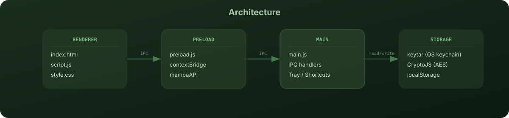

<div align="center">


<br>

<a href="https://www.electronjs.org"></a> <a href="https://nodejs.org"></a>  

</div>

---

## What is Mamba?

Mamba is a floating desktop widget for daily focus. It combines **task management**, **persistent notes**, and a **Pomodoro timer** into a single always-on-top glassmorphic panel.

No notifications from other apps, no browser tabs, no distractions. Just your tasks, your thoughts, and a timer — sitting quietly in the corner of your screen.

### Why it's different

Most productivity tools demand your attention. Mamba works the other way: it stays out of the way until you need it, then disappears when you're done. The widget:

- Launches with your system and runs silently
- Hides to a floating launcher or system tray
- Toggles with a single keyboard shortcut (`Ctrl + Shift + T`)
- Encrypts all task data using your OS keychain

## Architecture

<div align="center">
  
</div>

The application follows Electron's best practices with four distinct layers:

1. **Renderer** — The glassmorphic UI (`index.html`, `style.css`, `script.js`). Handles tabs, tasks, notes, and timers.
2. **Preload** — A minimal IPC bridge (`preload.js`) exposing only four safe channels: notifications, widget toggle, and task storage.
3. **Main** — Window management, tray integration, global shortcuts, and encryption via OS keychain (`main.js`).
4. **Storage** — AES-encrypted task file stored in `%APPDATA%/mamba-widget/`. The encryption key lives in your OS keychain.

## Key Features


| Feature | Description |
|---------|-------------|
| **Glassmorphic UI** | 25px backdrop blur with nature-inspired green palette and smooth cubic-bezier transitions |
| **Task Management** | Category-coded tasks (Study, Work, Personal) with progress tracking and time-based reminders |
| **Persistent Notes** | Auto-saving text area that preserves your notes across sessions |
| **Pomodoro Timer** | 25-minute focus sessions with pulse animation and system notifications |
| **Floating Launcher** | 80×80 pulsing icon for instant widget access anywhere on your desktop |
| **System Integration** | Tray menu, global shortcuts, and auto-launch at startup |
| **Preview Mode** | Toggle to hide input fields and focus purely on your task list |
| **Encrypted Storage** | AES encryption with OS keychain — your data stays private |

## Quick Start

### Prerequisites

- **Node.js** 18 or later
- **npm** (comes with Node.js)

### Development

```bash
# Clone and install
git clone https://github.com/abm1119/widgets.git
cd widgets
npm install

# Run the widget
npm start
```

### Build

```bash
# Create Windows portable build
npm run build
```


### Portable Distribution

1. Download `MambaWidget_Portable.zip`
2. Extract and run `MambaWidget.exe` — no installation required

## Shortcuts

| Shortcut | Action |
|----------|--------|
| `Ctrl + Shift + T` | Toggle widget visibility |
| `Enter` (in task input) | Quick-add a new task |
| Right-click tray icon | Open menu (Toggle / Quit) |

## Data Storage

All tasks are encrypted and stored locally:

```
%APPDATA%/mamba-widget/tasks.enc
```

The encryption key is stored in your OS keychain (via `keytar`). Your data never leaves your machine.

### Reset Data

To start fresh, delete the encrypted tasks file:

```bash
rm %APPDATA%/mamba-widget/tasks.enc
```

## Usage Tips

- **Preview mode** — Click the "Preview" chip to hide input fields and focus on your task list.
- **Task reminders** — Set a time on any task. When the clock matches, Mamba sends a system notification and plays a sound alert.
- **Category coding** — Assign Study, Work, or Personal categories for color-coded visual organization.
- **Test alerts** — Use the "Test Sound & Notify" button in the Timers tab to verify your system audio and notification settings.
- **Hiding vs. quitting** — Closing the widget only hides it. Right-click the tray icon and select "Quit Mamba" to fully exit.

## Project Structure

```
widgets/
├── assets/               # Project assets
│   └── readme/           # README images and diagrams
├── index.html            # Main widget UI structure
├── style.css             # Glassmorphic theme and animations
├── script.js             # Task, notes, and timer logic
├── main.js               # Electron main process (windows, tray, IPC)
├── preload.js            # IPC bridge (context isolation)
├── mamba.png             # App icon and tray icon
├── mamba.ico             # Windows icon
├── alert.mp3             # Timer and reminder sound
├── DESIGN_SYSTEM.md      # Visual design tokens and components
├── package.json          # Dependencies and build scripts
└── README.md             # This file
```

## Tech Stack

- **Electron** 42 — Desktop runtime
- **keytar** — OS-native keychain access for encryption keys
- **crypto-js** — AES encryption for task data
- **auto-launch** — System startup integration
- **Inter** — Typography (Google Fonts)
- **Vanilla JS/CSS** — No framework overhead; pixel-perfect glassmorphic UI

## Design

Mamba is built upon a curated design system that balances functional clarity with a calming user experience. Our visual language centers on nature-inspired greens and organic forms.

See [DESIGN_SYSTEM.md](./DESIGN_SYSTEM.md) for the complete tokens, typography, and component specifications.

### Color Palette

| Color | Hex | Usage |
|-------|-----|-------|
| `--mamba-leaf` | `#4A7B4F` | Brand / Primary actions |
| `--mamba-deep` | `#2F4D2F` | Primary text |
| `--mamba-creme` | `#F7F4E8` | Card backgrounds |
| `--mamba-soft` | `#D9F2D3` | Secondary surfaces |
| `--mamba-body` | `#C7E8C4` | Surface / Background |

## Browser Compatibility

As an Electron app, Mamba uses Chromium as its rendering engine. The widget window is frameless, transparent, and always-on-top.

| Feature | Supported |
|---------|-----------|
| Windows 10+ | ✅ |
| macOS | ⚠️ (requires build config change) |
| Linux | ⚠️ (requires build config change) |

## Contributing

Contributions are welcome. The codebase is small and well-structured:

1. Fork the repository
2. Create a feature branch (`git checkout -b feature/my-feature`)
3. Commit changes (`git commit -m 'Add my feature'`)
4. Push and open a Pull Request

### Development Notes

- The widget window size is fixed at `380×520` — any UI changes should fit within these dimensions.
- CSS custom properties (`--mamba-leaf`, `--mamba-deep`, etc.) define the color system. Modify these for theme changes.
- IPC communication is strictly limited to four channels via `preload.js`. Add new channels there, not directly in the renderer.
- Always use existing CSS variables (`--mamba-*`, `--radius-*`, `--shadow-*`) rather than hardcoding values.

## License

MIT © Mamba Team

---

<div align="center">

Stay focused, stay green. 🌿

</div>
